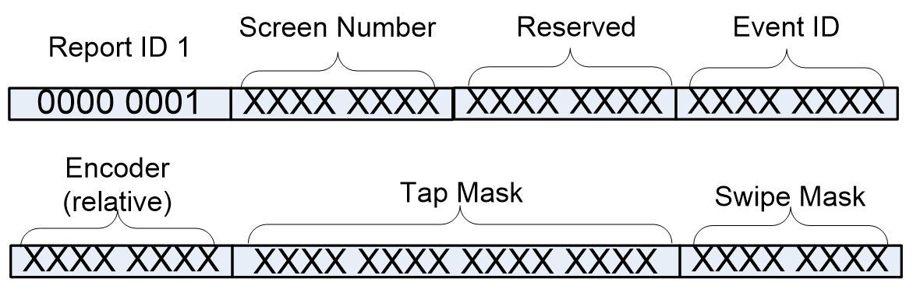
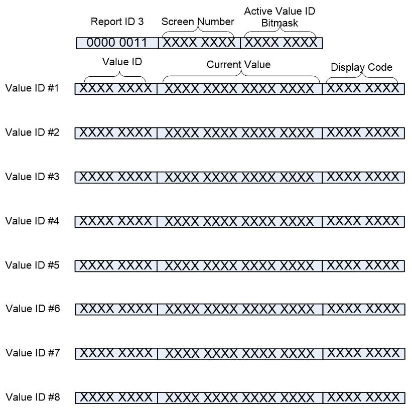
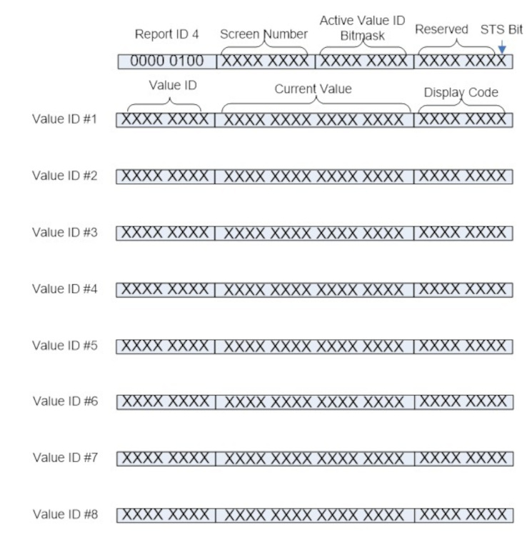
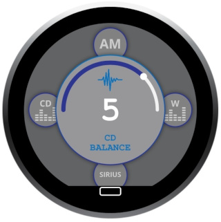
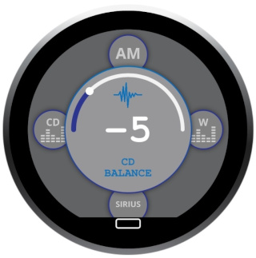
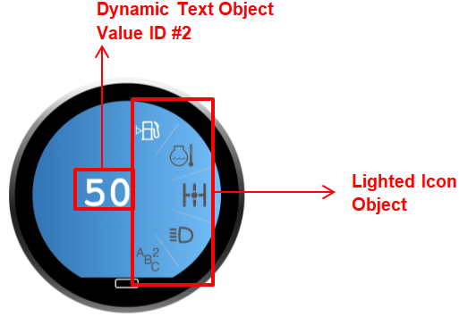

# HID USB Documentation #

## 1. Overview ##

The USB interface of the Touch Encoder product is designed to conform to the USB 2.0 specification and, specifically, the USB HID protocol. This protocol allows system integrators to retrieve the data from, or send data to, the device using the ubiquitous USB HID support in the host OS. For more information about the USB standard or the USB HID support in your specific host OS, please visit the USB web site (usb.org) or contact the OS vendor.

The Touch Encoder device connects to the host as a composite USB device with two Generic HID interfaces. The HID interfaces consist of several top-level collections (TLC) to virtually separate different device functions. Each report type generated by either the host (OUT) or the device (IN) will have a unique report ID to denote which interface and TLC it is associated with.

The Generic HID interfaces are primarily used to send data to the host application. However, they also allow the host application to make changes to the configuration of the device, including screen/widget settings.

In order to identify the Touch Encoder within the OS, use the following USB Vendor ID (VID), Product ID (PID) combination:

|     |        |                                             |
|-----|--------|---------------------------------------------|
| VID | 0x1658 | Grayhill, Inc.                              |
| PID | 0x0060 | Touch Encoder, 2nd generation Touch Encoder |

## 2. Generic HID Interfaces ##

The Touch Encoder device’s Generic HID Interfaces are designed to interface with the generic HID support in the host OS. This means that the host OS does not consume the data itself, but that the data needs to be retrieved (IN report) or transmitted (OUT report) by an application or a driver running on the host device.

When new information is available from the device, a new report of the appropriate type is generated. Each report type can be generated by the device at a maximum rate of approximately 60 Hz, although it is possible that the device generates mixed-type reports at a faster rate.

The different types of USB reports for this interface are explained below.

### 2.1 USB Reports ###
#### 2.1.1 Events Data Report (IN) ####

    Interface  #: 1
    Collection #: 1
    Report ID  #: 1

The Events Report is the lowest-level report generated by the Touch Encoder device. Even though the Touch Encoder is designed to automatically respond to events occurring on the device, it will use this type of report to keep the host application informed about those events as well. In addition to the Events Data report, the device will also send a Widgets Data (IN) report to the host when an event causes a new widget/screen to be displayed on the device or causes one of the widget values to change. This method of sending a widget report as well as the underlying event report is implemented in order to allow the host to closely monitor the activity of the device, and for the host to respond appropriately should a data mismatch occur.

The Events report is 8 bytes long and contains the report ID byte followed by the current event data. The event data consists of a Screen Number byte, a reserved byte, an Event ID byte, an Encoder byte, a Tap Mask word and a Swipe byte.

The Encoder byte is a signed 8-bit value containing the relative change in encoder position since the last event report. It uses a special signing, like that used in the Touch Encoder CAN protocol, where a value of 0 is shown as 0x80. For example, if the encoder was turned two detents in the positive (CW) direction since the last report, the Encoder byte would be 0x82. Similarly, if the encoder was turned three detents in the negative (CCW) direction since the last report, the Encoder byte would be 0x7D (notation for -3). In case the encoder was not turned but the Events report was transmitted because another event value changed, then the encoder byte would remain 0x80.

The Tap Mask word is a 16-bit value containing the tap information currently available. The most significant bit of the 16-bit value shows whether or not a tap occurred since the last Event report. The remaining 15 bits contain a bit mask of the tap zones the tap occurred in. The bit mask is defined as follows:

| Bit # | Zone #  |
|-------|---------|
| Bit0  | Zone 0  |
| Bit1  | Zone 1  |
| Bit2  | Zone 2  |
| Bit3  | Zone 3  |
| Bit4  | Zone 4  |
| Bit5  | Zone 5  |
| Bit6  | Zone 6  |
| Bit7  | Zone 7  |
| Bit8  | Zone 8  |
| Bit9  | Zone 9  |
| Bit10 | Zone 10 |
| Bit11 | Zone 11 |
| Bit12 | Zone 12 |
| Bit13 | Zone 13 |
| Bit14 | Zone 14 |

The Swipe Mask byte is an 8-bit value containing the swipe information currently available. The most significant bit of this byte shows whether or not a swipe occurred since the last Event report. The least significant 4 bits contain a bit mask of the direction in which the swipe occurred. The bit mask is defined as follows:

| Bit # | Swipe gesture |
|-------|---------------|
| Bit0  | Up            |
| Bit1  | Down          |
| Bit2  | Left          |
| Bit3  | Right         |

#### 2.1.2 Command Report (OUT) ####

|            |    |
|------------|----|
| Interface  | #1 |
| Collection | #2 |
| Report ID  | #2 |

The Command Report is the lowest-level control available to the USB host controller. It allows modification of system-level attributes, such as the display’s backlight level.

The Command Report is 9 bytes long, with the first byte being the Report ID, the second byte being the Command ID, and the remaining 7 bytes being reserved for any Command-specific data.

The 8 bytes following the Report ID are meant to emulate the 8 byte Command messages in the Touch Encoder’s CAN J1939 protocol, simplifying documentation and implementation for both, the host device and the Touch Encoder. Currently, only the Backlight Control and Reboot Device commands are supported in the Touch Encoder USB protocol.

##### 2.1.2.1 Backlight Control #####

The backlight control command report uses a Command ID of 0x80 (128) and the second command-specific data byte as the new percentage of backlight brightness.
The permitted range for the new percentage (data byte 2) is from 0x00 (0%) to 0x64 (100%).

As an example, the report to change the backlight to 100% would look like:

	Interface #1, Collection #2, OUT: [ 02 80 00 64 xx xx xx xx xx ]

Similarly, the report to change the backlight to 30% would look like:

	Interface #1, Collection #2, OUT: [ 02 80 00 1E xx xx xx xx xx ]

##### 2.1.2.2 Reboot Device #####

The reboot device command report uses a Command ID of 0x44 (68).

As an example, the report to reboot the TE device would look like:

    Interface #1, Collection #2, OUT: [ 02 44 xx xx xx xx xx xx xx ]

#### 2.1.3 Widget Data Report (IN) ####

    Interface  #: 2
    Collection #: 1
    Report ID  #: 3

This type of report is sent automatically by the device to the host whenever an event on the device causes a new screen to be displayed or causes one of the current screen’s “Value ID” values to change. This type of report is used to keep the host informed about the widgets and “in-sync” with the device.
The Screen Number byte is an 8-bit value containing the screen number currently being displayed on the device.

The Active Value ID Bitmask byte is a bitmask of the individual Value IDs that are currently active on the screen. There are 8 Value IDs available per screen ranging from 0x01 to 0x80. For each of the Value IDs listed in the Active Value ID Bitmask, one of the following Value ID Information Sections is populated.

The Value ID Information Section contains current value information for each of the up to eight active Value IDs on the current screen. Each field in this section contains a Value ID byte, a Current Value associated with that Value ID and a Display Code.

The Current Value field is constrained by the initial conditions, minimum and maximum values, and the step constraints defined during the design stage in the IDE. However, the host has the ability to overwrite or initialize the Current Value field.

The Display Code field contains a code specifying the format to apply to the Current Value before it is displayed on the widget.

#### 2.1.4 Modify Widget Data Report (OUT) ####

    Interface  #: 2
    Collection #: 2
    Report ID  #: 4

##### 2.1.4.1 Display Code and Decimal Code #####

The Display Code can allow the Touch Encoder to display decimal values within text boxes, while still using the 16-bit integer values for the respective Value ID’s.
To do this, we use the top 4 bits of the Display Code as a signed 4-bit integer (which we call the Decimal Code). This integer is used as an exponent value with a base of 10, like in scientific notation.
As a quick note, this Decimal Code is only relevant for Value ID’s which are used by text boxes.

| Display Code | Input | Output |
|--------------|-------|--------|
| 0x1X         | 10    | 100    |
| 0x2X         | 100   | 1000   |
| .            | .     | .      |
| 0xEX         | 10    | 0.1    |
| 0xFX         | 100   | 1      |

##### 2.1.4.2 Screen Transition Suppression #####

The Screen Transition Suppressor (STS) enables the Touch Encoder to modify variable data of the target screen without first transitioning to that screen. If the corresponding bit is set, the Touch Encoder will not perform a screen transition prior to applying a data change. This feature is only available for Firmware version 3.1.0 or higher.

| Value       | Action                              |
|-------------|-------------------------------------|
| 0xX0        | Value update & screen change        |
| 0xX1        | Value update only (no screen change)|

##### 2.1.4.3 Update Widget Data Examples #####

#### Example 1 ####
The figure below displays an example of updating the gauge widget data.

The ring gauge object is designated as Value ID #1 and set as screen 7.

    Interface #1, Collection #4, OUT:

 	[04] [07] [03] [00] [01] [57] [00] [00] xx xx xx xx xx xx xx xx xx xx xx xx xx xx xx xx xx xx xx xx xx xx xx xx

#### Example 2 ####

The figure below displays an example of updating the ring gauge widget data to 5 and -5.

|Radio Ring Gauge 1| Radio Ring Gauge 2|
|:-:|:-:|
|||

The ring gauge object is designated as Value ID #1 and set as screen 9.

    Interface #1, Collection #4, OUT:

    [04] [09] [03] [00] [01] [05] [00] [00] xx xx xx xx xx xx xx xx xx xx xx xx xx xx xx xx xx xx xx xx xx xx xx xx
    [04] [09] [03] [00] [01] [FB] [FF] [00] xx xx xx xx xx xx xx xx xx xx xx xx xx xx xx xx xx xx xx xx xx xx xx xx

#### Example 3 ####

The figure below displays an example of updating lighted Icons.

The ring gauge object is designated as Value ID #1 and set as screen 6.

    Interface #1, Collection #4, OUT:
    Light up icon 1 background.
    [04] [06] [03] [00] [01] [01 80] [00] xx xx xx xx xx xx xx xx xx xx xx xx xx xx xx xx xx xx xx xx xx xx xx xx
    Light up icon 2 background.
    [04] [06] [03] [00] [01] [02 80] [00] xx xx xx xx xx xx xx xx xx xx xx xx xx xx xx xx xx xx xx xx xx xx xx xx
    Light up icon 3 background.
    [04] [06] [03] [00] [01] [04 80] [00] xx xx xx xx xx xx xx xx xx xx xx xx xx xx xx xx xx xx xx xx xx xx xx xx
    Light up icon 4 background.
    [04] [06] [03] [00] [01] [08 80] [00] xx xx xx xx xx xx xx xx xx xx xx xx xx xx xx xx xx xx xx xx xx xx xx xx
    Light up icon 1 and 2 background.
    [04] [06] [03] [00]  [01] [03 80] [00] xx xx xx xx xx xx xx xx xx xx xx xx xx xx xx xx xx xx xx xx xx xx xx xx
    Light up icon 1, 2, and 3 background.
    [04] [06] [03] [00] [01] [07 80] [00] xx xx xx xx xx xx xx xx xx xx xx xx xx xx xx xx xx xx xx xx xx xx xx xx
    Light up icon 1, 2, 3 and 4 background.
    [04] [06] [03] [00] [01] [0F 80] [00] xx xx xx xx xx xx xx xx xx xx xx xx xx xx xx xx xx xx xx xx xx xx xx xx

#### Example 4 ####

The figure below displays an example of a multi-value widget.

The dynamic text object is designated at Value ID #1. The lighted icon object is designated as Value ID #3.

Below is the sequence of messages to turn on the top lighted icon and change the dynamic text to 100 (note that the lighted icon object has an offset of 0x8000).

    Interface #1, Collection #4, OUT:
    Light up icon 1 and change the dynamic text to decimal 53.
    [04] [0C] [05] [00]  [01 35 00 00] [00 00 00 00] [04 01 80 00] xx xx xx xx xx xx xx xx xx xx xx xx xx xx xx xx xx xx xx xx
    Light up icon 2 and change the dynamic text to decimal 54.
    [04] [0C] [05] [00] [01 36 00 00] [00 00 00 00] [04 02 80 00] xx xx xx xx xx xx xx xx xx xx xx xx xx xx xx xx xx xx xx xx
    Light up icon 3 and change the dynamic text to decimal 55.
    [04] [0C] [05] [00]  [01 37 00 00] [00 00 00 00] [04 04 80 00] xx xx xx xx xx xx xx xx xx xx xx xx xx xx xx xx xx xx xx xx
    Light up icon 4 and change the dynamic text to decimal 56.
    [04] [0C] [05] [00] [01 38 00 00] [00 00 00 00] [04 08 80 00] xx xx xx xx xx xx xx xx xx xx xx xx xx xx xx xx xx xx xx xx
    Light up icon 5 and change the dynamic text to decimal 57.
    [04] [0C] [05] [00]  [01 39 00 00] [00 00 00 00] [04 10 80 00] xx xx xx xx xx xx xx xx xx xx xx xx xx xx xx xx xx xx xx xx

## 3. Mouse HID Interface ##

The Mouse HID interface of the Touch Encoder is designed to interface directly with the mouse driver of the host OS. The interface generates USB reports that contain relative motion, as well as left, and right mouse button click data.

The firmware on the Touch Encoder is responsible for processing the hardware button data and the touch data reported by the touch controller, and converting this data into the mouse data format. This processing includes converting individual touch points (as reported by the touch controller) to relative mouse motion data, smoothing the motion data to reduce noise while keeping the processing latency as low as possible, and calculating the duration of individual touches to determine if a tap or other single-touch gesture occurred.

The supported single-touch gestures are as follows:

Tap – touch did not move significantly and was shorter than approximately 360 milliseconds in duration

Drag Enable – touch did not move significantly and was longer than 1 second in but shorter than 2 seconds in duration

Right-Click – touch did not move significantly and was longer than 2 seconds in duration

The “Tap” gesture is realized by sending a single report with the left-click button active, which also allows the use of a double-tap to generate a double-click.

If the “Drag Enable” gesture mentioned above is followed by (significant) relative motion of the touch on the touch pad surface, then the firmware will send persistent left-click reports for as long as the touch is active on the pad. This allows for items to be “pinned” by performing the gesture and then moving them across the screen. The dragging stops when the touch is lifted off the screen.

The “Right-Click” gesture mentioned above causes the device to send a single report with the right-click button active. This results in a right-click menu being opened. The user can then use simple touch motion to move the mouse cursor to the desired menu selection.

### 3.1 USB Reports ###

#### 3.1.1 Mouse Report (IN) ####

| Name                | Byte # | Value               |
|---------------------|--------|---------------------|
| Report ID 6         | 1      | 0000 0110           |
| Mouse Button Mask   | 2      | 0000 00XX           |
| X Relative Position | 3-4    | XXXX XXXX XXXX XXXX |
| Y Relative Position | 5-6    | XXXX XXXX XXXX XXXX |
| Relative Wheel Data | 7      | XXXX XXXX           |
| Reserved            | 8      | XXXX XXXX           |

This type of report is 8 bytes long and contains the report ID byte, followed by 1 byte of button mask data, 2 bytes of relative X position data, 2 bytes of relative Y position data, 1 byte of relative wheel data, and 1 reserved byte. The button mask indicates whether the left (bit 0) or right (bit 1) buttons are either active (1) or inactive (0). The button bits reflect the output of the single-touch gesture recognition mentioned above. The Relative Wheel Data contains the TE encoder output. The final byte is currently reserved for future use.

While touches are being sensed on the touch surface, this report is generated at a rate of approximately 60 Hz.